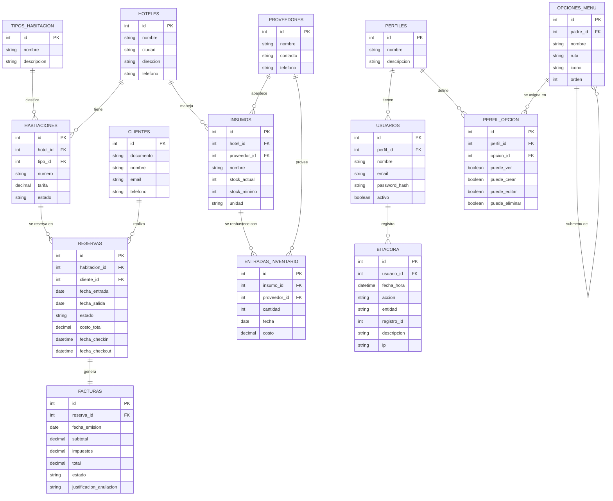

# Fase 2 — Diseño · Modelo de Datos (Entidad-Relación)

> Esta es la **estructura de la base de datos**: qué tablas existen, qué datos guarda cada una y cómo se relacionan.
> Es la columna vertebral del sistema. Si esto está bien pensado, todo lo demás se construye más fácil.

---

## 1. Recordatorio de conceptos

- **PK (Primary Key / Clave primaria):** identificador único de cada fila (el `id`).
- **FK (Foreign Key / Clave foránea):** columna que apunta a la PK de otra tabla para relacionarlas.
- **1:N:** "uno a muchos" (ej. un hotel → muchas habitaciones).
- **1:1:** "uno a uno" (ej. una reserva → una factura).

---

## Convención de auditoría (aplica a TODAS las tablas)

Para garantizar la trazabilidad a nivel de registro, **todas las tablas de negocio** incluyen estas 4 columnas estándar (no se repiten en cada tabla de abajo para no saturar; se asumen presentes en todas):

| Columna | Tipo | Para qué |
|---------|------|----------|
| creado_por | entero (FK → usuarios.id) | Quién creó el registro |
| fecha_creacion | fecha/hora | Cuándo se creó |
| modificado_por | entero (FK → usuarios.id) | Quién lo modificó por última vez |
| fecha_modificacion | fecha/hora | Cuándo se modificó por última vez |

> **Diferencia con la tabla `bitacora`:** estas columnas guardan solo el **estado actual** (quién creó y quién modificó por última vez cada fila). La `bitacora` guarda el **historial completo** de cada acción. Se complementan.
>
> **Excepción:** la tabla `bitacora` no lleva estas columnas (es un registro inmutable que ya incluye usuario y fecha_hora).

---

## 2. Tablas (entidades)

### usuarios
Quienes operan el sistema. Su rol se define por el **perfil** asignado (no por un texto suelto).
| Columna | Tipo | Notas |
|---------|------|-------|
| id (PK) | entero | Identificador único |
| nombre | texto | |
| email | texto | Único, sirve para iniciar sesión |
| password_hash | texto | Contraseña **cifrada** (nunca en texto plano) |
| perfil_id (FK) | entero | → perfiles.id |
| activo | booleano | Permite inhabilitar un usuario sin borrarlo |

### perfiles
Roles del sistema (control de acceso basado en roles / RBAC).
| Columna | Tipo | Notas |
|---------|------|-------|
| id (PK) | entero | |
| nombre | texto | "Administrador", "Recepcionista", "Inventario", "Cajero" |
| descripcion | texto | |

### opciones_menu
Opciones/módulos del menú del sistema. Guardarlas en BD permite un **menú dinámico** por perfil.
| Columna | Tipo | Notas |
|---------|------|-------|
| id (PK) | entero | |
| nombre | texto | Ej: "Reservas", "Reporte de ocupación" |
| ruta | texto | URL de la pantalla (ej. `/reservas`) |
| icono | texto | Nombre del ícono (opcional) |
| padre_id (FK) | entero | → opciones_menu.id (para submenús; null si es de primer nivel) |
| orden | entero | Posición en el menú |

### perfil_opcion
Tabla intermedia: define qué puede hacer cada perfil en cada opción de menú (relación N:M con permisos finos).
| Columna | Tipo | Notas |
|---------|------|-------|
| id (PK) | entero | |
| perfil_id (FK) | entero | → perfiles.id |
| opcion_id (FK) | entero | → opciones_menu.id |
| puede_ver | booleano | |
| puede_crear | booleano | |
| puede_editar | booleano | |
| puede_eliminar | booleano | |

### hoteles
Cada hotel de la cadena.
| Columna | Tipo | Notas |
|---------|------|-------|
| id (PK) | entero | |
| nombre | texto | |
| ciudad | texto | |
| direccion | texto | |
| telefono | texto | |

### tipos_habitacion
Categorías de habitación (sencilla, doble, suite…).
| Columna | Tipo | Notas |
|---------|------|-------|
| id (PK) | entero | |
| nombre | texto | Ej: "Suite" |
| descripcion | texto | |

### habitaciones
Cada habitación física de un hotel.
| Columna | Tipo | Notas |
|---------|------|-------|
| id (PK) | entero | |
| hotel_id (FK) | entero | → hoteles.id |
| tipo_id (FK) | entero | → tipos_habitacion.id |
| numero | texto | Ej: "302" |
| tarifa | decimal | Precio por noche |
| estado | texto | disponible, ocupada, limpieza, fuera_de_servicio |

### clientes
Huéspedes de la cadena.
| Columna | Tipo | Notas |
|---------|------|-------|
| id (PK) | entero | |
| documento | texto | Cédula/pasaporte, único |
| nombre | texto | |
| email | texto | |
| telefono | texto | |

### reservas
Una reserva de una habitación por un cliente.
| Columna | Tipo | Notas |
|---------|------|-------|
| id (PK) | entero | |
| habitacion_id (FK) | entero | → habitaciones.id |
| cliente_id (FK) | entero | → clientes.id |
| fecha_entrada | fecha | |
| fecha_salida | fecha | |
| estado | texto | pendiente, confirmada, en_curso, finalizada, cancelada |
| costo_total | decimal | tarifa × noches |
| fecha_checkin | fecha/hora | Se llena al hacer check-in |
| fecha_checkout | fecha/hora | Se llena al hacer check-out |

### facturas
Factura generada al cerrar una estadía.
| Columna | Tipo | Notas |
|---------|------|-------|
| id (PK) | entero | |
| reserva_id (FK) | entero | → reservas.id |
| fecha_emision | fecha | |
| subtotal | decimal | |
| impuestos | decimal | |
| total | decimal | |
| estado | texto | pendiente, pagada, anulada |
| justificacion_anulacion | texto | Solo si se anula |

### proveedores
Empresas que abastecen insumos.
| Columna | Tipo | Notas |
|---------|------|-------|
| id (PK) | entero | |
| nombre | texto | |
| contacto | texto | Persona de contacto |
| telefono | texto | |

### insumos
Productos consumibles (toallas, jabones, etc.) por hotel.
| Columna | Tipo | Notas |
|---------|------|-------|
| id (PK) | entero | |
| hotel_id (FK) | entero | → hoteles.id |
| proveedor_id (FK) | entero | → proveedores.id (proveedor principal) |
| nombre | texto | |
| stock_actual | entero | Cantidad disponible |
| stock_minimo | entero | Umbral para alerta |
| unidad | texto | Ej: "unidad", "litro" |

### entradas_inventario
Registro de compras que aumentan el stock.
| Columna | Tipo | Notas |
|---------|------|-------|
| id (PK) | entero | |
| insumo_id (FK) | entero | → insumos.id |
| proveedor_id (FK) | entero | → proveedores.id |
| cantidad | entero | |
| fecha | fecha | |
| costo | decimal | |

### bitacora
Registro automático de los movimientos realizados en la aplicación (auditoría/trazabilidad).
| Columna | Tipo | Notas |
|---------|------|-------|
| id (PK) | entero | |
| usuario_id (FK) | entero | → usuarios.id (quién hizo la acción) |
| fecha_hora | fecha/hora | Cuándo ocurrió |
| accion | texto | crear, editar, eliminar, login, anular… |
| entidad | texto | Módulo/tabla afectada (ej. "reservas") |
| registro_id | entero | Id del registro afectado (opcional) |
| descripcion | texto | Detalle legible (ej. "Canceló la reserva #45") |
| ip | texto | Dirección IP del usuario (opcional) |

---

## 3. Relaciones (en palabras)

- Un **hotel** tiene muchas **habitaciones**. *(1:N)*
- Un **tipo_habitacion** clasifica muchas **habitaciones**. *(1:N)*
- Un **cliente** hace muchas **reservas**. *(1:N)*
- Una **habitación** puede tener muchas **reservas** (en distintas fechas). *(1:N)*
- Una **reserva** genera una **factura**. *(1:1)*
- Un **hotel** maneja muchos **insumos**. *(1:N)*
- Un **proveedor** abastece muchos **insumos** y muchas **entradas_inventario**. *(1:N)*
- Un **insumo** tiene muchas **entradas_inventario**. *(1:N)*
- Un **usuario** genera muchas entradas de **bitácora**. *(1:N)*
- Un **perfil** lo tienen muchos **usuarios**. *(1:N)*
- Un **perfil** tiene acceso a muchas **opciones_menu**, y una opción la usan muchos perfiles → se resuelve con **perfil_opcion**. *(N:M)*
- Una **opción_menu** puede tener submenús (se referencia a sí misma con `padre_id`). *(1:N reflexiva)*

---

## 4. Diagrama Entidad-Relación

> Este diagrama se renderiza automáticamente en GitHub (es código Mermaid). La "pata de gallo" (crow's foot) indica el lado "muchos".

---

## 5. Notas de diseño (decisiones)

- **`usuarios`** controla el acceso y, además, es el origen de la **`bitacora`**: cada acción importante queda registrada con el usuario que la realizó (auditoría/trazabilidad).
- **`bitacora`** la llena el sistema **automáticamente**, no el usuario a mano. Conviene registrar al menos: inicios de sesión, creación/edición/eliminación de registros, cancelaciones de reservas y anulaciones de facturas.
- **Seguridad por perfiles (RBAC):** el acceso NO se controla con un texto de rol en `usuarios`, sino con el trío `perfiles` + `opciones_menu` + `perfil_opcion`. Ventaja: cambiar permisos o crear roles nuevos es configuración (datos), no programación. El **menú se arma dinámicamente** leyendo qué opciones tiene asignado el perfil del usuario logueado.
- El campo `activo` en `usuarios` permite **inhabilitar** a alguien sin borrar su historial (importante por la auditoría).
- La **tarifa** se guarda en cada `habitacion` para permitir precios distintos por hotel dentro de la misma cadena.
- El **check-in/out** se modela como fechas dentro de `reservas` (campos `fecha_checkin` y `fecha_checkout`) más el `estado`, en lugar de una tabla aparte, para mantenerlo simple.
- Más adelante, si se quisiera registrar **servicios extra** (minibar, lavandería) en la factura, se añadiría una tabla `servicios` y una intermedia `factura_servicios` (relación N:M).
