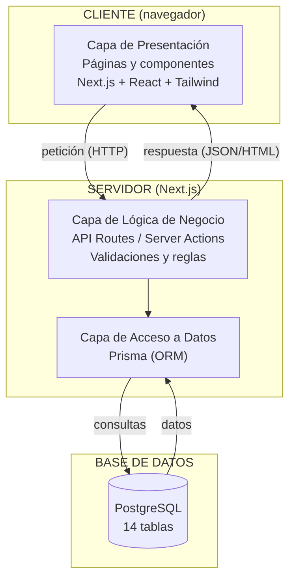
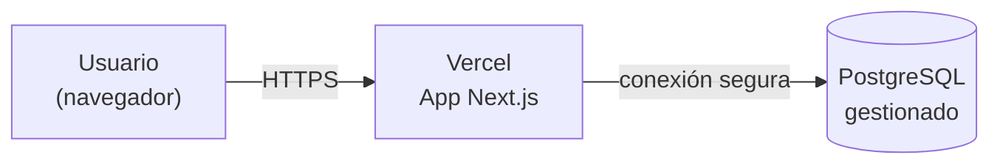

# Fase 2 — Diseño · Arquitectura del Sistema

> La arquitectura describe **cómo se organizan las piezas del sistema y cómo se comunican**.
> Si el modelo de datos dice "qué guardamos", la arquitectura dice "cómo está construido y cómo fluye la información".

---

## 1. Estilo arquitectónico

Usaremos una **arquitectura en capas** sobre un modelo **cliente-servidor**, construida como una **aplicación full-stack con Next.js**.

- **Cliente-servidor:** el navegador del usuario (cliente) pide información; el servidor responde.
- **En capas:** el código se separa por responsabilidades para que sea fácil de mantener.

### Las 4 capas

| Capa | Responsabilidad | Ejemplo en el hotel |
|------|-----------------|---------------------|
| **1. Presentación** | Lo que el usuario ve e interactúa (UI). | Formulario para crear una reserva. |
| **2. Lógica de negocio** | Las reglas y validaciones. | "No reservar si la habitación está ocupada"; "total = tarifa × noches". |
| **3. Acceso a datos** | Hablar con la base de datos (consultar/guardar). | Guardar la reserva en la tabla `reservas`. |
| **4. Base de datos** | Almacenar los datos. | Las 14 tablas del modelo de datos. |

> **Regla de oro:** cada capa solo habla con la de al lado. La presentación nunca toca la base de datos directamente; pasa por la lógica y el acceso a datos. Así, si cambias una capa, las demás no se rompen.

---

## 2. Stack tecnológico

| Componente | Tecnología | ¿Por qué? |
|------------|-----------|-----------|
| **Frontend (presentación)** | Next.js (React) + Tailwind CSS | Componentes reutilizables y estilos rápidos. |
| **Backend (lógica + acceso a datos)** | Next.js (API Routes / Server Actions) + TypeScript | Mismo proyecto que el frontend; TypeScript evita errores de tipos. |
| **ORM (acceso a datos)** | Prisma | Permite hablar con la base de datos usando código en vez de SQL a mano, de forma segura. |
| **Base de datos** | PostgreSQL | Relacional, robusta y gratuita; encaja con nuestro modelo de tablas. |
| **Autenticación / seguridad** | Sesión + control por perfil (RBAC) | Conecta con `perfiles` / `perfil_opcion` del modelo de datos. |
| **Despliegue** | Vercel (app) + Postgres gestionado (ej. Neon/Supabase) | Vercel está hecho para Next.js; la BD se hospeda aparte. |

> **¿Qué es un ORM?** Es un traductor entre el código y la base de datos. En vez de escribir SQL (`SELECT * FROM reservas...`), escribes algo como `prisma.reserva.findMany()`. Es más seguro (evita inyección SQL) y más fácil de leer.

---

## 3. Diagrama de arquitectura



---

## 4. Flujo de una petición (ejemplo: crear una reserva)

Así viaja la información de punta a punta:

1. **Presentación:** el recepcionista llena el formulario de reserva y da clic en "Guardar".
2. La pantalla envía los datos al **servidor** (una petición HTTP).
3. **Lógica de negocio:** el servidor valida → ¿la habitación está libre en esas fechas? ¿el cliente existe? Calcula el costo total.
4. Si todo está bien, llama a la **capa de acceso a datos** (Prisma).
5. **Acceso a datos:** Prisma inserta la fila en la tabla `reservas` de **PostgreSQL** y registra el movimiento en `bitacora`.
6. El servidor responde a la pantalla: "Reserva creada".
7. **Presentación:** la pantalla muestra el mensaje de éxito y la nueva reserva en el listado.

> Fíjate cómo cada capa hizo solo su parte. Eso es la arquitectura en capas funcionando.

---

## 5. Estructura de carpetas propuesta (Next.js)

```
src/
├── app/                  → Páginas y rutas (Capa de Presentación)
│   ├── login/
│   ├── habitaciones/
│   ├── reservas/
│   ├── facturacion/
│   └── api/              → Endpoints del backend (Lógica de negocio)
├── components/           → Componentes reutilizables (botones, tablas, formularios)
├── lib/                  → Utilidades y la conexión a Prisma (Acceso a datos)
├── services/             → Reglas de negocio por módulo (reservas, facturación…)
└── types/                → Tipos de TypeScript

prisma/
└── schema.prisma         → Definición de las 14 tablas (el modelo de datos en código)
```

---

## 6. Vista de despliegue (cómo queda en producción)



- La aplicación Next.js se publica en **Vercel**.
- La base de datos PostgreSQL vive en un servicio gestionado (Neon, Supabase, etc.).
- El usuario accede por internet vía **HTTPS** (conexión cifrada → RNF de seguridad).

---

## 7. Decisiones de arquitectura (y por qué)

- **Monolito full-stack con Next.js** (en vez de frontend y backend separados): más simple de aprender y desplegar; suficiente para el tamaño del proyecto. Si la cadena creciera muchísimo, podría migrarse a servicios separados más adelante.
- **PostgreSQL** sobre una base no relacional: nuestros datos tienen relaciones claras (hoteles → habitaciones → reservas), justo lo que una base relacional maneja mejor.
- **Prisma como ORM:** seguridad (evita inyección SQL) y el `schema.prisma` se vuelve la fuente única de verdad del modelo de datos.
- **Seguridad por capas:** la validación de permisos (RBAC) ocurre en la **capa de lógica**, nunca confiando solo en ocultar botones en la pantalla.
