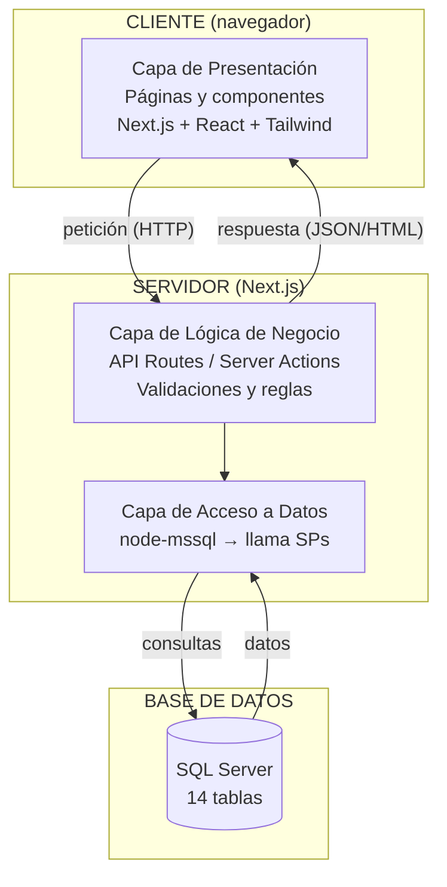
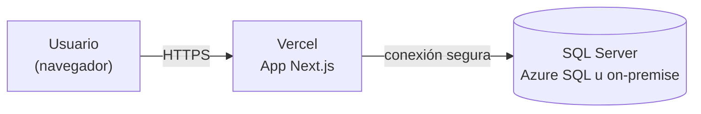

# Fase 2 — Diseño · Arquitectura del Sistema

> La arquitectura describe **cómo se organizan las piezas del sistema y cómo se comunican**.
> Si el modelo de datos dice "qué guardamos", la arquitectura dice "cómo está construido y cómo fluye la información".

---

## 1. Estilo arquitectónico

Usaremos una **arquitectura en capas** sobre un modelo **cliente-servidor**, construida como una **aplicación full-stack con Next.js**.

- **Cliente-servidor:** el navegador del usuario (cliente) pide información; el servidor responde.
- **En capas:** el código se separa por responsabilidades para que sea fácil de mantener.

### Las 4 capas

| Capa | Responsabilidad | Ejemplo en el hotel |
|------|-----------------|---------------------|
| **1. Presentación** | Lo que el usuario ve e interactúa (UI). | Formulario para crear una reserva. |
| **2. Lógica de negocio** | Las reglas y validaciones. | "No reservar si la habitación está ocupada"; "total = tarifa × noches". |
| **3. Acceso a datos** | Hablar con la base de datos (consultar/guardar). | Guardar la reserva en la tabla `reservas`. |
| **4. Base de datos** | Almacenar los datos. | Las 14 tablas del modelo de datos. |

> **Regla de oro:** cada capa solo habla con la de al lado. La presentación nunca toca la base de datos directamente; pasa por la lógica y el acceso a datos. Así, si cambias una capa, las demás no se rompen.

---

## 2. Stack tecnológico

| Componente | Tecnología | ¿Por qué? |
|------------|-----------|-----------|
| **Frontend (presentación)** | Next.js (React) + Tailwind CSS | Componentes reutilizables y estilos rápidos. |
| **Backend (lógica + acceso a datos)** | Next.js (API Routes / Server Actions) + TypeScript | Mismo proyecto que el frontend; TypeScript evita errores de tipos. |
| **Acceso a datos** | node-mssql (driver) + **procedimientos almacenados** | La lógica de datos vive en SPs de SQL Server; el driver los invoca con parámetros tipados (protegido contra inyección SQL). |
| **Base de datos** | SQL Server | Relacional y robusta; encaja con nuestro modelo de tablas y con el entorno existente. La lógica de datos se implementa con **procedimientos almacenados**. |
| **Autenticación / seguridad** | Sesión + control por perfil (RBAC) | Conecta con `perfiles` / `perfil_opcion` del modelo de datos. |
| **Despliegue** | Vercel (app) + SQL Server (Azure SQL u on-premise) | Vercel está hecho para Next.js; la BD se hospeda aparte (en la nube o servidor propio). |

> **¿Por qué procedimientos almacenados (SPs)?** Un SP es un bloque de SQL guardado **dentro de la base de datos** con un nombre (ej. `sp_crear_reserva`). La aplicación solo lo llama y le pasa parámetros; toda la lógica de datos (validar, insertar, calcular, registrar en bitácora) vive en la BD. Ventajas: rendimiento, lógica centralizada y reutilizable, y encaja con las prácticas de equipos SQL Server.
>
> **¿Cómo se conecta la app?** Con la librería **node-mssql**: abre un *pool* de conexiones a SQL Server y ejecuta los SPs pasando parámetros **tipados y parametrizados** (lo que evita la inyección SQL). La cadena de conexión define servidor, base de datos, usuario, contraseña y cifrado.
>
> **Versionado de la BD:** como no usamos migraciones automáticas, el esquema (CREATE TABLE) y los procedimientos almacenados se guardan como scripts `.sql` en la carpeta `database/` del repositorio, para que la base de datos también quede versionada en git.

---

## 3. Diagrama de arquitectura



---

## 4. Flujo de una petición (ejemplo: crear una reserva)

Así viaja la información de punta a punta:

1. **Presentación:** el recepcionista llena el formulario de reserva y da clic en "Guardar".
2. La pantalla envía los datos al **servidor** (una petición HTTP).
3. **Lógica de negocio:** el servidor valida → ¿la habitación está libre en esas fechas? ¿el cliente existe? Calcula el costo total.
4. Si todo está bien, llama a la **capa de acceso a datos**, que ejecuta el procedimiento almacenado `sp_crear_reserva` vía node-mssql.
5. **Acceso a datos / SP:** el procedimiento almacenado valida, inserta la fila en `reservas` de **SQL Server** y registra el movimiento en `bitacora`, todo dentro de la base de datos.
6. El servidor responde a la pantalla: "Reserva creada".
7. **Presentación:** la pantalla muestra el mensaje de éxito y la nueva reserva en el listado.

> Fíjate cómo cada capa hizo solo su parte. Eso es la arquitectura en capas funcionando.

---

## 5. Estructura de carpetas propuesta (Next.js)

> Nota: el proyecto se crea **sin la carpeta `src`**, por lo que `app/` y las demás carpetas van en la raíz.

```
app/                      → Páginas y rutas (Capa de Presentación)
├── login/
├── habitaciones/
├── reservas/
├── facturacion/
└── api/                  → Endpoints del backend (Lógica de negocio)
components/               → Componentes reutilizables (botones, tablas, formularios)
lib/                      → Conexión a SQL Server (pool de node-mssql) y utilidades
services/                → Acceso a datos: funciones que llaman a los SPs por módulo
types/                   → Tipos de TypeScript

database/                 → La base de datos versionada como scripts .sql
├── 01-schema.sql         → CREATE TABLE de las 14 tablas
└── procedures/           → Un archivo .sql por procedimiento almacenado
    ├── sp_crear_reserva.sql
    ├── sp_listar_habitaciones.sql
    └── ...
```

---

## 6. Vista de despliegue (cómo queda en producción)



- La aplicación Next.js se publica en **Vercel**.
- La base de datos **SQL Server** vive en Azure SQL o en un servidor propio (on-premise). Si es on-premise, debe ser accesible desde donde corre la app.
- El usuario accede por internet vía **HTTPS** (conexión cifrada → RNF de seguridad).

---

## 7. Decisiones de arquitectura (y por qué)

- **Monolito full-stack con Next.js** (en vez de frontend y backend separados): más simple de aprender y desplegar; suficiente para el tamaño del proyecto. Si la cadena creciera muchísimo, podría migrarse a servicios separados más adelante.
- **SQL Server** sobre una base no relacional: nuestros datos tienen relaciones claras (hoteles → habitaciones → reservas), justo lo que una base relacional maneja mejor. Además se alinea con el entorno tecnológico existente.
- **Procedimientos almacenados + node-mssql** (en vez de un ORM como Prisma): la lógica de datos se centraliza en la base de datos y encaja con el entorno SQL Server existente. Los parámetros tipados de node-mssql mantienen la protección contra inyección SQL. El esquema y los SPs se versionan como scripts `.sql` en `database/`.
- **Seguridad por capas:** la validación de permisos (RBAC) ocurre en la **capa de lógica**, nunca confiando solo en ocultar botones en la pantalla.
