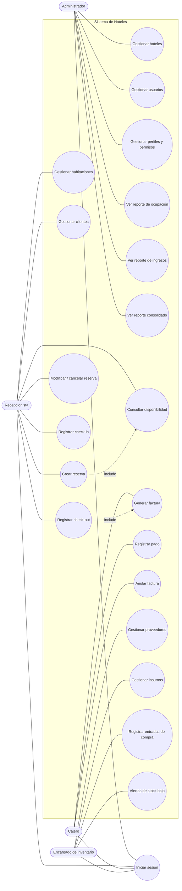

# Fase 2 — Diseño · Casos de Uso (UML)

> Un **caso de uso** describe qué puede hacer cada **actor** con el sistema para lograr un objetivo.
> Es la vista del sistema "desde afuera": el *qué*, no el *cómo*.

---

## 1. Actores

Los actores corresponden a los **perfiles** del modelo de seguridad (RBAC):

| Actor | Descripción |
|-------|-------------|
| **Administrador** | Configura el sistema y consulta reportes globales de la cadena. |
| **Recepcionista** | Opera el día a día del hotel: habitaciones, reservas, clientes, check-in/out. |
| **Cajero** | Gestiona la facturación y los cobros. |
| **Encargado de inventario** | Administra proveedores, insumos y compras. |

> Todos los actores comparten el caso de uso **"Iniciar sesión"**.

---

## 2. Casos de uso por actor

### Administrador
- Gestionar hoteles
- Gestionar usuarios (crear, activar/inhabilitar)
- Gestionar perfiles y permisos (menú dinámico)
- Ver reporte de ocupación
- Ver reporte de ingresos
- Ver reporte consolidado de la cadena

### Recepcionista
- Gestionar habitaciones y tipos
- Consultar disponibilidad
- Gestionar clientes
- Crear reserva *(incluye: Consultar disponibilidad)*
- Modificar / cancelar reserva
- Registrar check-in
- Registrar check-out *(incluye: Generar factura)*

### Cajero
- Generar factura
- Registrar pago
- Anular factura

### Encargado de inventario
- Gestionar proveedores
- Gestionar insumos
- Registrar entradas de compra
- Recibir alertas de stock bajo

---

## 3. Diagrama de casos de uso

> Los actores son los óvalos `([ ])` a los lados; los casos de uso son los círculos `(( ))` en el centro. Se renderiza en GitHub.

---

## 4. Especificación detallada de un caso de uso

Cada caso de uso importante puede documentarse en detalle. Ejemplo:

### CU-07 · Crear reserva

| Campo | Detalle |
|-------|---------|
| **Actor** | Recepcionista |
| **Objetivo** | Apartar una habitación para un cliente en unas fechas. |
| **Precondiciones** | El recepcionista inició sesión; el cliente existe (o se crea en el momento). |
| **Flujo principal** | 1. El recepcionista selecciona hotel y fechas. 2. El sistema muestra las habitaciones disponibles *(include: Consultar disponibilidad)*. 3. Selecciona habitación y cliente. 4. El sistema calcula el costo total. 5. El recepcionista confirma. 6. El sistema guarda la reserva y la registra en la bitácora. |
| **Flujos alternativos** | - 2a. No hay habitaciones disponibles → el sistema avisa y no permite continuar. - 5a. La habitación fue tomada mientras tanto → el sistema rechaza y pide elegir otra. |
| **Postcondiciones** | La reserva queda guardada con estado "confirmada"; visible en el listado. |
| **Requisitos** | RF-06, RF-07, RF-10 |

> Para el resto de casos de uso se seguiría esta misma plantilla cuando se necesite el detalle.
